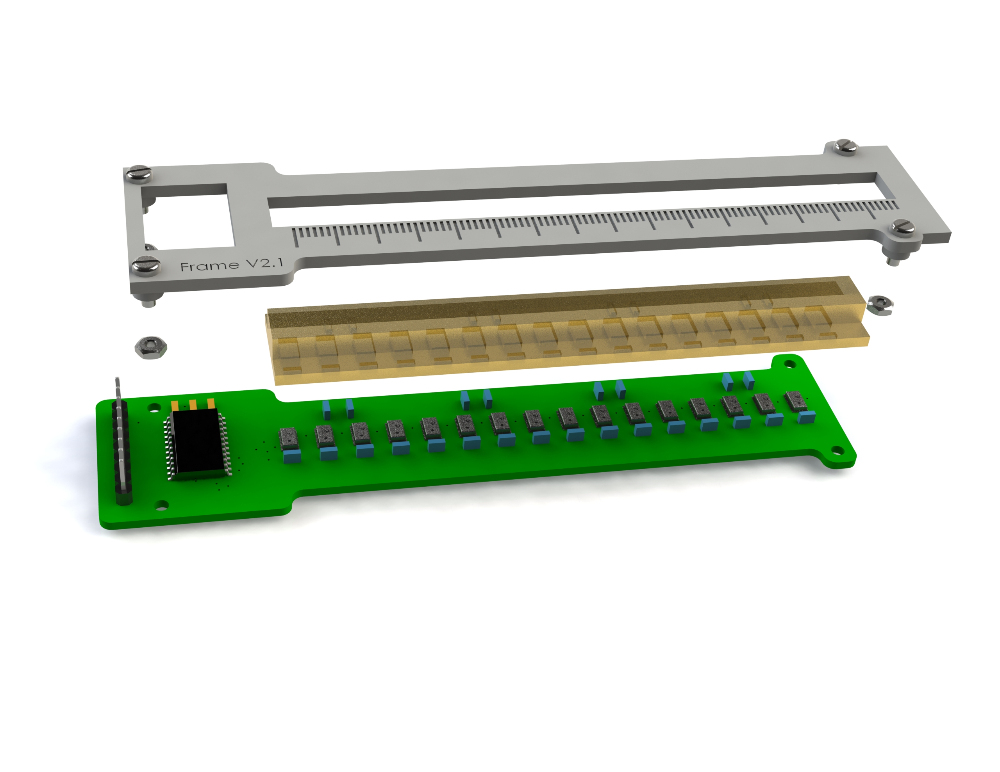
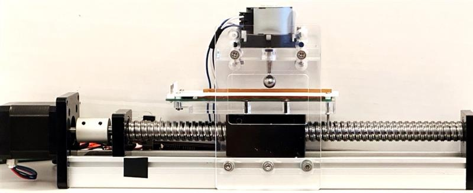
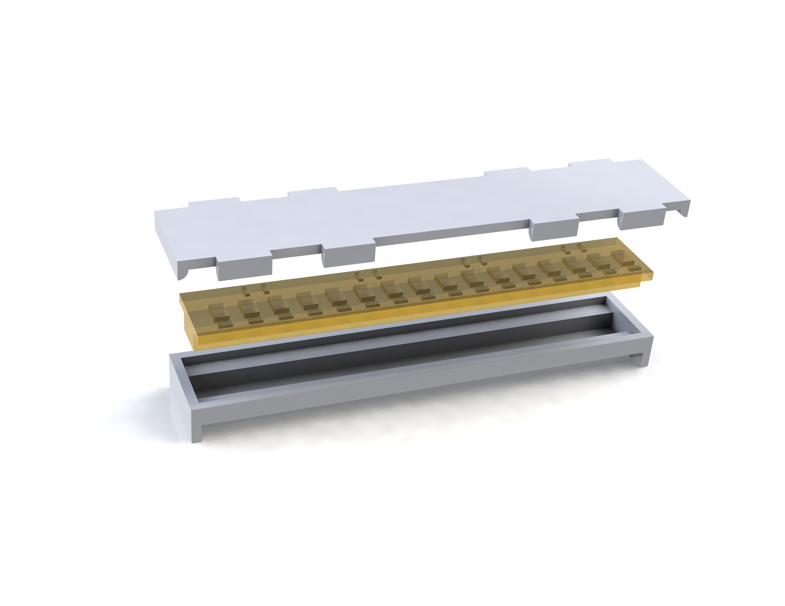

# Hardware Design

This folder contains the hardware design files.

## Folder Structure

The repository is organized into the following folders:

**PCB Design**: This folder contains schematics and layout files for our PCB. *PCB/MTL_BaroTactile_MPL3115A2/MTL_BaroTact1D_V3* is the one we used for super-resolution. *PCB/MTL_BaroTactile_MS5840/MTL_BaroTact1D_V4* is a new PCB design, which uses the MS-5840 barometer instead of the MPL3115A2 (stopped manufacturing).

**Testing Rig Design**: In this folder, you'll find the 3D-printed components on our testing rig.

**Mold**: This folder contains CAD files related to the mold used in the manufacturing process and assembly method of rubber components and sensors within our hardware.

