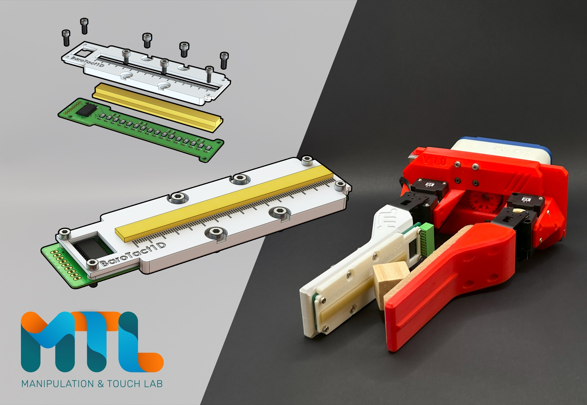
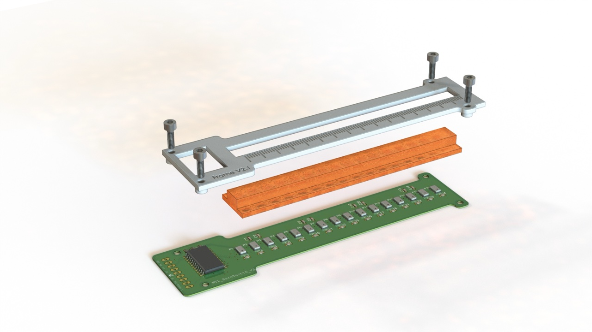
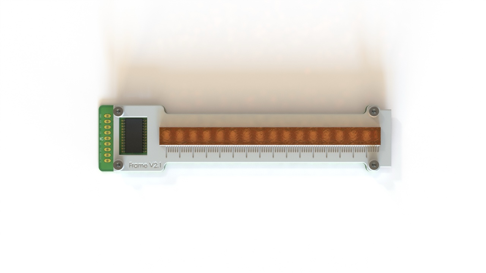
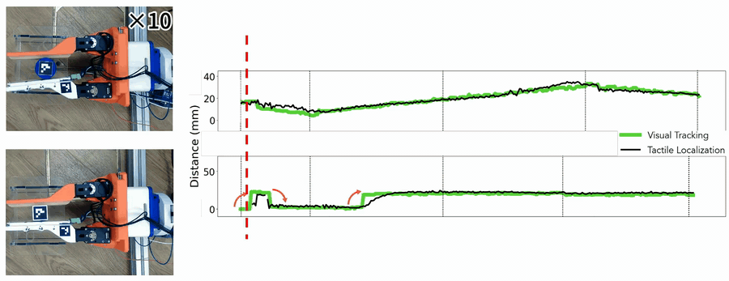

# MTL_BaroTactile

**A cost-efficient, repairable barometric tactile sensor**

[](https://ieeexplore.ieee.org/abstract/document/10770605)
[](https://doi.org/10.1109/TRO.2024.3508315)
[](https://www.imperial.ac.uk/manipulation-touch/)

<p align="center">
  
</p>

## Highlights

- **Low cost:** material cost below **80 USD**, built from 16 MPL3115A2 MEMS barometers on a single PCB.
- **Repairable:** the rubber layer is molded **separately** rather than over the barometers, then clamped on by a 3D-printed frame, so a worn surface can be swapped in minutes.

## Sensor Design

<p align="center">
  
  
</p>

The sensor has three layers:

1. **PCB**: 16 MPL3115A2 barometers in a 1D array, read through a multiplexer.
2. **Rubber**: a VytaFlex 40 strip cast in a 3D-printed mold.
3. **Frame**: a 3D-printed clamp bolted to the PCB that holds the rubber in place.

## Demo: Real-Time Localization on the E-TRoll Gripper

<p align="center">
  
</p>

The sensor is mounted on one finger of the open-source
[**E-TRoll gripper**](https://www.imperial.ac.uk/manipulation-touch/open-source/hardware/e-troll/)
from the Manipulation and Touch Lab. The gripper rolls a cube and a cylinder across the
sensing surface, and the tactile estimate (black) closely tracks the camera-based ground truth (green).
The video plays at 10× speed.

## Repository Structure

- **[Code](Code/)**: Arduino code for the sensor (MPL3115A2) and the testing rig
- **[Hardware](Hardware/)**: PCB designs, 3D CAD files and testing rig hardware
  - **[PCB/MTL_BaroTactile_MPL3115A2](Hardware/PCB/MTL_BaroTactile_MPL3115A2/)**: main sensor version (used in the paper)
  - **[PCB/MTL_BaroTactile_MS5840](Hardware/PCB/MTL_BaroTactile_MS5840/)**: alternative version with the MS5840
  - **[Mold](Hardware/Mold/)**: rubber mold and frame CAD for fabrication
  - **[TestingRig](Hardware/TestingRig/)**: automated indentation rig for data collection

## Hardware Versions

### MPL3115A2 Version (Paper Implementation)
The primary sensor design, built with the MPL3115A2 barometric pressure sensor.

### MS5840 Version (Alternative)
An alternative design built with the MS5840 barometer. Use it when the MPL3115A2 is out of stock; it gives comparable performance for barometric tactile sensing.

## Fabrication Overview

1. 3D print the rubber mold and apply mold release spray.
2. Mix parts A and B of Smooth-On VytaFlex 40, de-gas the mixture, and pour it into the mold.
3. Close the mold and let it cure for at least 1 day, then remove the rubber.
4. Reflow-solder the components onto the PCB.
5. Place the rubber on the PCB, then bolt the 3D-printed frame over it until the rubber is held securely.

## Citation

If you use this work in your research, please cite our paper:

```bibtex
@ARTICLE{10770605,
  author={Hou, Jian and Zhou, Xin and Spiers, Adam},
  journal={IEEE Transactions on Robotics},
  title={Location and Orientation Super-Resolution Sensing With a Cost-Efficient and Repairable Barometric Tactile Sensor},
  year={2025},
  volume={41},
  pages={729-741},
  doi={10.1109/TRO.2024.3508315}
}
```
